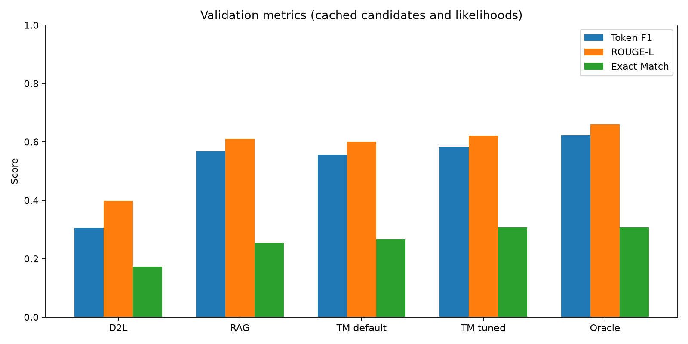
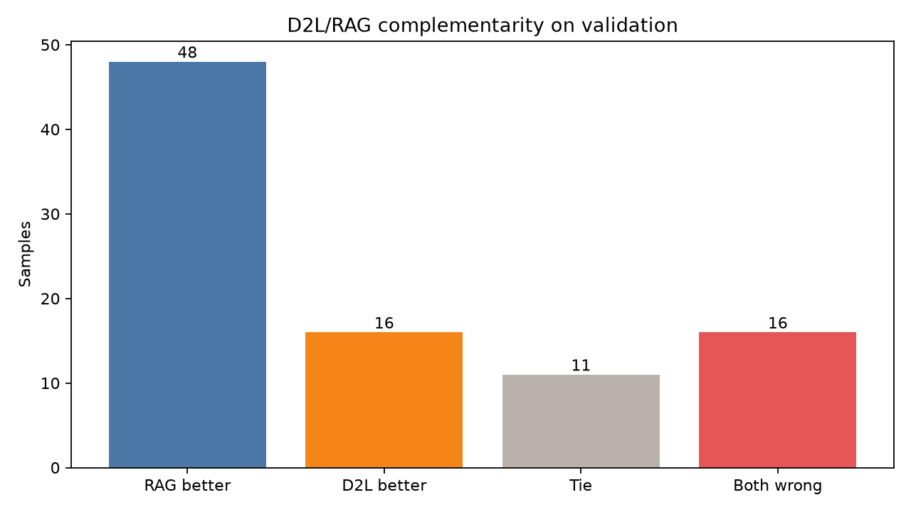
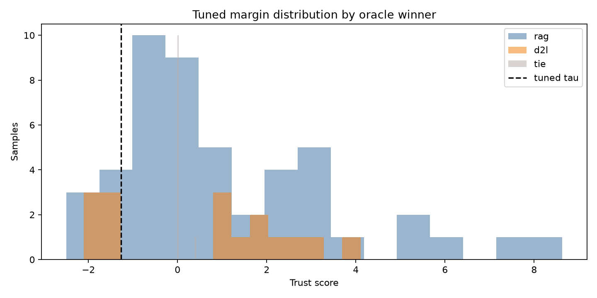

# TrustMargin D2L–RAG validation report

Validation gồm **75 mẫu**, chỉ dùng split `validation`; held-out test chưa được chạy hoặc dùng để tune. D2L dùng các passage do retriever chọn (`retrieved`), không dùng `ground_truth_context`.

## Kết quả chính

| Phương pháp | Token F1 | ROUGE-L | Exact Match |
|---|---:|---:|---:|
| D2L | 0.3058 | 0.3978 | 0.1733 |
| RAG | 0.5675 | 0.6094 | 0.2533 |
| TM default | 0.5563 | 0.6001 | 0.2667 |
| TM tuned | 0.5829 | 0.6207 | 0.3067 |
| Oracle | 0.6223 | 0.6608 | 0.3067 |

- RAG better: **48**; D2L better: **16**; tie: **11**; both wrong (F1 < 0.2): **16**.
- Oracle gain trên best single source: **+0.0548 token-F1**.
- TM tuned gain trên best single source: **+0.0154 token-F1**.
- TM tuned thu hồi **28.0%** oracle gain khả dụng.
- Paper/project default: `lambda_bind=0.5`, `tau=-1.5`.
- Validation tuned: `lambda_bind=0.0`, `tau=-1.27122`; chọn RAG 63/75 mẫu.

## Chất lượng pipeline và lỗi còn lại

- Candidate còn bị truncate sau retry: **0**; candidate không vượt heuristic tiếng Việt: **2** (đều là câu trả lời số ngắn, không phải output tiếng Anh).
- Thời gian trung bình/sample: retrieval `84.98s`, adapter `3.51s`, RAG generation `3.54s`, D2L generation `1.87s`, scoring `1.62s`, total `95.52s`.
- `both wrong` dùng ngưỡng token-F1 thay vì Exact Match vì câu trả lời sinh tự do hiếm khi khớp chuỗi tuyệt đối.
- Kết quả tuned là in-sample validation; chỉ held-out test mới xác nhận khả năng tổng quát hóa.

## Kết luận

Có complementarity rõ ràng, nhưng TM tuned mới thu hồi **28.0%** oracle gap. Đáng chạy thêm đúng một held-out test để xác nhận, chưa đủ bằng chứng để mở rộng quy mô. Việc cấu hình tốt nhất có `lambda_bind=0` cũng cho thấy binding term hiện chưa đóng góp tích cực; lợi ích đang đến từ threshold trên likelihood margin.

## Artifact

- `../validation_candidates.jsonl`: prompt outputs, retrieved passages, raw/normalized answers, generation diagnostics và generation latency.
- `../validation_scored.jsonl`: candidate cache cộng likelihood scores; đổi threshold không cần chạy lại model.
- `../validation_default_results.jsonl` và `../validation_tuned_results.jsonl`: per-sample selected source, final answer, `m_prior`, `m_bind`, `delta_*`, trust score và threshold.
- `../validation_default_report.json` và `../validation_tuned_report.json`: aggregate metrics và toàn bộ sweep trials.
- `../split_manifest.json`: seed, source hash, validation IDs và held-out IDs.
